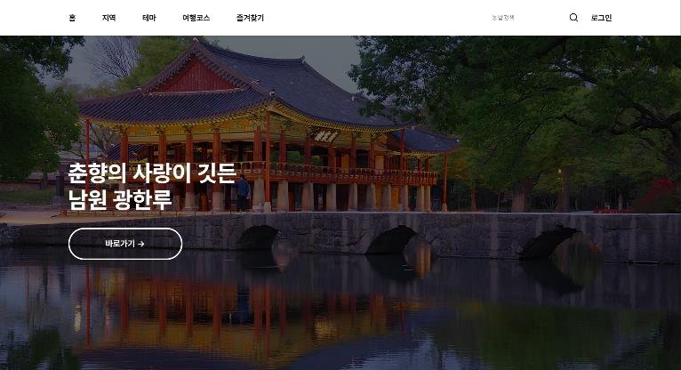
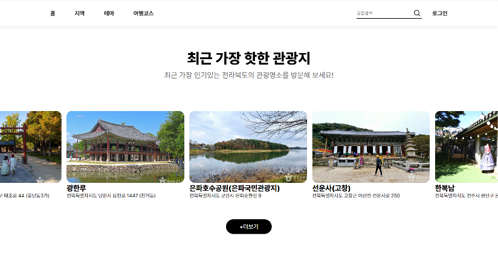
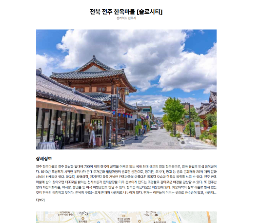

# Jeonbuk Tour Project

## 📌 프로젝트 개요
**목적**: 전라북도 관광 활성화를 위해, 사용자 리뷰와 공공데이터를 기반으로 관광지를 추천하고 맞춤형 여행
코스를 자동 생성하는 웹 플랫폼을 제작.

**특징**:
- 실사용자 리뷰 데이터 기반 추천 (콘텐츠 기반 필터링)
- 위경도 좌표를 활용한 **실제 거리 기반 여행 코스 추천**
- 마이페이지, 즐겨찾기, 최근 본 관광지 등 사용자 맞춤형 기능 포함
- 외부 API(KakaoMap)와의 연동을 통해 직관적인 시각화 제공

---

## 🖥 주요 화면
> 현재는 서버가 종료되어 접속할 수 없어, 개발 당시 화면을 캡처해 첨부합니다.

| 메인 | 최근 가장 핫한 관광지 |
| --- | --- |
|  |  |
| 대표 관광지 슬라이드와 상세 페이지 이동 | 크롤링한 구글 리뷰를 분석해 인기순으로 정렬한 관광지 슬라이드 |

**관광지 상세**
공공데이터 API로 받은 관광지 정보와 리뷰를 보여주고, 하단에서 TF-IDF·코사인 유사도로 미리 계산해 둔 유사 관광지를 추천합니다. (캡처는 상단 정보 영역)

---

## ⚙️ 주요 기능

### 1. 관광지 리뷰 수집 및 자연어 처리
- **Selenium**을 사용해 **Google Map 리뷰를 자동 크롤링**
  → JavaScript로 로딩되는 리뷰 페이지에 동적으로 접근하고, 반복적으로 "더 보기" 버튼을 클릭
- **Pandas**로 수집된 리뷰 데이터를 전처리 후 MySQL에 저장
- 관광지별 소개글·카테고리·리뷰를 하나의 문서로 합친 뒤, **Okt(Open Korean Text) 형태소 분석기**로 형태소 단위 분리 및 어간 추출
- **불용어 리스트(stopwords.txt)** 를 적용하여 의미 없는 단어들을 제거
- **TF-IDF**로 관광지별 문서 벡터 생성 (자주 나오지만 변별력 없는 단어의 가중치는 낮춤)

### 2. 관광지 추천 시스템
- TF-IDF 벡터 간 **Cosine Similarity(코사인 유사도)** 로 관광지별 유사 관광지 상위 5개를 미리 계산해 DB에 저장하고, 상세 페이지에서 조회
- 추천 알고리즘은 **Python으로 직접 구현 →** **Flask API 서버**를 통해 결과 반환

### 3. 여행 코스 추천 기능
사용자가 선택한 관광지를 기반으로 **최적의 여행 경로**를 자동 추천하는 기능입니다.

- **사용자가 선택한** 관광지의 위도/경도를 기반으로 거리 계산
- **Haversine 공식으로 관광지 간 실제 거리**를 계산
- 최단 거리 순서로 관광지를 정렬 **→ 최적의 여행 코스 자동 추천**
- **KakaoMap API**로 마커, 경로, 순서를 지도에 시각화

### 4. 마이페이지 및 즐겨찾기 기능
- **사용자의 기본 정보와 최근 본 관광지 리스트** 제공 (조회 시 관광지 ID 저장)
- **즐겨찾기(찜) 목록 관리**
- 즐겨찾기 기반 **맞춤형 추천 기능** 제공

### 5. 데이터베이스 및 DAO 구조
- **MySQL 테이블:** 관광지, 리뷰, 사용자, 찜 목록 등
- **DAO 모듈화** (`favorites_dao.py`, `user_dao.py` 등)
    - **CRUD** 캡슐화, 기능별 모듈 분리
    - **비즈니스 로직과 데이터 접근 분리 → 유지보수성 향상**

### 6. 지도 시각화 – Kakao Map API
- **Kakao Map API** 활용
- 관광지 마커, 경로 연결, 순서 번호를 JS로 커스터마이징 하여 직관적 UI 구현

---

## 🛠 기술 스택
- **백엔드**: Python (Flask), REST API
- **프론트엔드**: HTML, CSS, JavaScript
- **데이터 분석**: Pandas, Okt, scikit-learn(TF-IDF, Cosine Similarity)
- **웹 크롤링**: Selenium, BeautifulSoup
- **데이터베이스**: MySQL
- **지도 시각화**: Kakao Map API
- **인프라 아키텍처**: DAO 패턴 기반 모듈화 설계

---

## ✨ 성과

- **실사용자 리뷰 데이터 기반 추천 시스템 구축**
- 형태소 분석 → TF-IDF 벡터화 → **자연어 처리와 유사도 분석을 직접 구현**
- 관광지 추천 + 최적 코스 추천을 **통합 서비스**로 제공
- 단순 추천을 넘어 **사용자 행동(최근 본 관광지, 즐겨찾기)** 기반 기능까지 확장

---

## 🚧 어려움 & 해결 (Troubleshooting)
1. **Google Maps 리뷰 크롤링**
    - 문제: JavaScript 기반 동적 로딩으로 리뷰가 제대로 수집되지 않음
    - 해결: Selenium 활용 → “더 보기” 버튼 반복 클릭 & 스크롤 이벤트 자동화
2. **자연어 처리 정확도**
    - 문제: 조사, 불필요 단어 등으로 추천 품질 저하
    - 해결: 불용어(stopwords.txt) 정의, 특수문자 제거 후 형태소 분석·어간 추출로 표현 통일
3. **데이터베이스 설계**
    - 문제: 기능 확장(즐겨찾기, 최근 본 관광지) 시 테이블 구조 복잡화
    - 해결: DAO 모듈화를 통해 SQL과 비즈니스 로직 분리 → 유지보수성 확보

---

## 🌟 프로젝트 의의
- 단순 크롤링/시각화를 넘어 **실사용자 리뷰 기반 추천 알고리즘 직접 구현**
- **자연어 처리 → 벡터화 → 유사도 계산 → 추천 시스템**으로 이어지는 데이터 분석 파이프라인 경험
- Flask + MySQL + 외부 API를 활용한 **백엔드-프론트 통합 아키텍처 구축 경험**
- 사용자 행동 데이터(찜, 최근 본 관광지)를 활용해 **개인화 서비스**까지 확장

---

## 📌 향후 개선 방향

- 사용자 리뷰를 활용한 감성 분석 추가 적용
- 방문 시간/소요시간 기반의 여행 일정 자동 최적화 기능
- 숙소나 맛집 예약 및 결제 기능
